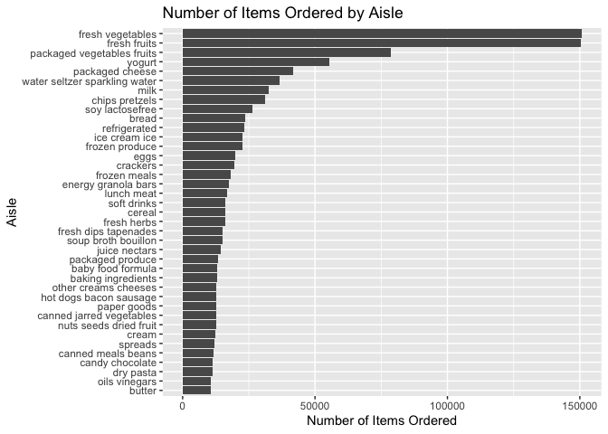

p8105_hw3_jt3649
================
Juan Tang
2025-10-09

## Problem 1

``` r
library(tidyverse)
```

    ## ── Attaching core tidyverse packages ──────────────────────── tidyverse 2.0.0 ──
    ## ✔ dplyr     1.1.4     ✔ readr     2.1.5
    ## ✔ forcats   1.0.0     ✔ stringr   1.5.1
    ## ✔ ggplot2   3.5.2     ✔ tibble    3.3.0
    ## ✔ lubridate 1.9.4     ✔ tidyr     1.3.1
    ## ✔ purrr     1.1.0     
    ## ── Conflicts ────────────────────────────────────────── tidyverse_conflicts() ──
    ## ✖ dplyr::filter() masks stats::filter()
    ## ✖ dplyr::lag()    masks stats::lag()
    ## ℹ Use the conflicted package (<http://conflicted.r-lib.org/>) to force all conflicts to become errors

``` r
#load the dataset
library(p8105.datasets)
data("instacart")
```

### Instacart dataset description

The instacart dataset contains 1384617 observations of 15 variables.
Each row represents a single product from an order. The key variables
include: order_id, product_id, add_to_cart_order, reordered, user_id,
eval_set, order_number, order_dow, order_hour_of_day,
days_since_prior_order, product_name, aisle_id, department_id, aisle,
department.

#### Describing variables

- `order_id` is order identifier.
- `product_id` and `product_name` are variables for product identifiers.
- `aisle_id` and `aisle` are aisle identifiers.
- `department_id` and `department` are department identifiers.
- `order_dow` is the day of the week that the order was placed.
- `order_hour_of_day` is the hour of the day that the order was placed.
- `days_since_prior_order` is the days since the last order.

#### Illustrative example of observations

For example, the first observation shows that product “Bulgarian Yogurt”
from the “yogurt” aisle was ordered on day 4 at hour 10.

### Answer questions

#### How many aisles are there, and which aisles are the most items ordered from?

``` r
aisle_count = instacart |>
  count(aisle, sort = TRUE) #group the rows with same aisle together and count how many rows fall into each group

n_aisle = nrow(aisle_count)
```

There are 134 aisles in the dataset. The most items are ordered from: 1.
fresh vegetables (150609 items) 2. fresh fruits (150473 items) 3.
packaged vegetables fruits (78493 items)

#### Make a plot that shows the number of items ordered in each aisle, limiting this to aisles with more than 10000 items ordered.

``` r
instacart |>
  count(aisle) |>
  #limit to aisle with more than 10000 items ordered
  filter(n > 10000) |> 
  mutate(aisle = fct_reorder(aisle, n)) |>
  #x-axis is aisle, y-axis is the count
  ggplot(aes(x = aisle, y = n)) + 
  geom_col() + 
  #the plot axis label cannot be seen clearly, hence flip the xy axis for better view
  coord_flip() + 
  labs(
    title = "Number of Items Ordered by Aisle", 
    x = "Aisle", 
    y = "Number of Items Ordered"
  )
```

<!-- -->

#### Make a table showing the three most popular items in each of the aisles “baking ingredients”, “dog food care”, and “packaged vegetables fruits”.

``` r
instacart |>
  #include only aisle with character variable “baking ingredients”, “dog food care”, and “packaged vegetables fruits”
  filter(aisle %in% c("baking ingredients", "dog food care", "packaged vegetables fruits")) |>
  group_by(aisle, product_name) |>
  #count the number of orders per product
  summarize(n = n()) |>
  #sort by aisle and count in descending order
  arrange(aisle, desc(n)) |>
  #select only for the top 3 items per aisle
  slice_head(n = 3) |>
  knitr::kable(
    col.names = c("Aisle", "Product Name", "Number of Orders"), 
    caption = "Three Most Popular Items in Selected Aisle"
  )
```

    ## `summarise()` has grouped output by 'aisle'. You can override using the
    ## `.groups` argument.

| Aisle | Product Name | Number of Orders |
|:---|:---|---:|
| baking ingredients | Light Brown Sugar | 499 |
| baking ingredients | Pure Baking Soda | 387 |
| baking ingredients | Cane Sugar | 336 |
| dog food care | Snack Sticks Chicken & Rice Recipe Dog Treats | 30 |
| dog food care | Organix Chicken & Brown Rice Recipe | 28 |
| dog food care | Small Dog Biscuits | 26 |
| packaged vegetables fruits | Organic Baby Spinach | 9784 |
| packaged vegetables fruits | Organic Raspberries | 5546 |
| packaged vegetables fruits | Organic Blueberries | 4966 |

Three Most Popular Items in Selected Aisle

#### Make a table showing the mean hour of the day at which Pink Lady Apples and Coffee Ice Cream are ordered on each day of the week

``` r
instacart |>
  filter(product_name %in% c("Pink Lady Apples", "Coffee Ice Cream")) |>
  # group by product and the day of week
  group_by(product_name, order_dow) |>
  # calculate the mean hour for each selected group
  summarize(mean_hour = mean(order_hour_of_day)) |>
  # reshape the data from long to wide
  pivot_wider(
    names_from = order_dow, # use the day of week as column names
    values_from = mean_hour # value in the table is the mean hour
  ) |>
  knitr::kable(
    digits = 2, # round to 2 decimal places
    col.names = c("Product", "Sunday", "Monday", "Tuesday", "Wednesday", "Thursday", "Friday", "Saturday"), 
    caption = "Mean Hour of Day for Orders on Each Day of the Week"
  )
```

    ## `summarise()` has grouped output by 'product_name'. You can override using the
    ## `.groups` argument.

| Product          | Sunday | Monday | Tuesday | Wednesday | Thursday | Friday | Saturday |
|:-----------------|-------:|-------:|--------:|----------:|---------:|-------:|---------:|
| Coffee Ice Cream |  13.77 |  14.32 |   15.38 |     15.32 |    15.22 |  12.26 |    13.83 |
| Pink Lady Apples |  13.44 |  11.36 |   11.70 |     14.25 |    11.55 |  12.78 |    11.94 |

Mean Hour of Day for Orders on Each Day of the Week
