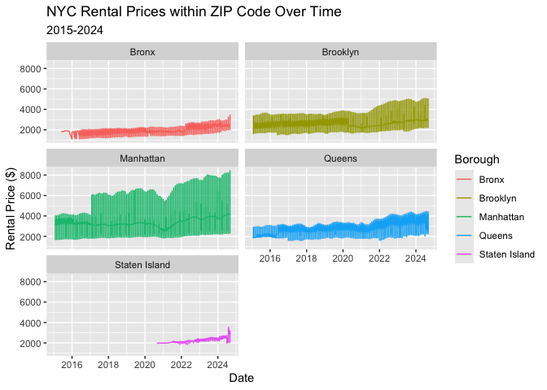
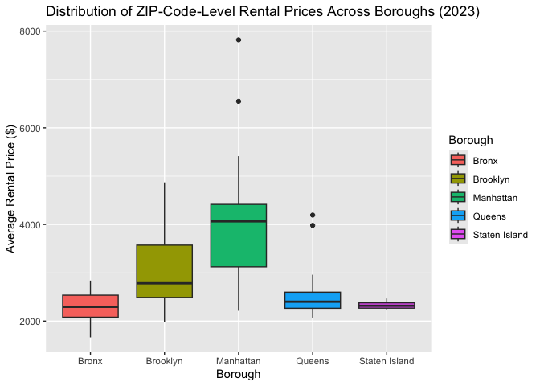

p8105_hw3_jt3649
================
Juan Tang
2025-10-09

## Problem 1

``` r
library(tidyverse)
```

    ## ── Attaching core tidyverse packages ──────────────────────── tidyverse 2.0.0 ──
    ## ✔ dplyr     1.1.4     ✔ readr     2.1.5
    ## ✔ forcats   1.0.0     ✔ stringr   1.5.1
    ## ✔ ggplot2   3.5.2     ✔ tibble    3.3.0
    ## ✔ lubridate 1.9.4     ✔ tidyr     1.3.1
    ## ✔ purrr     1.1.0     
    ## ── Conflicts ────────────────────────────────────────── tidyverse_conflicts() ──
    ## ✖ dplyr::filter() masks stats::filter()
    ## ✖ dplyr::lag()    masks stats::lag()
    ## ℹ Use the conflicted package (<http://conflicted.r-lib.org/>) to force all conflicts to become errors

``` r
library(patchwork)
#load the dataset
library(p8105.datasets)
data("instacart")
```

### Instacart dataset description

The instacart dataset contains 1384617 observations of 15 variables.
Each row represents a single product from an order. The key variables
include: order_id, product_id, add_to_cart_order, reordered, user_id,
eval_set, order_number, order_dow, order_hour_of_day,
days_since_prior_order, product_name, aisle_id, department_id, aisle,
department.

#### Describing variables

- `order_id` is order identifier.
- `product_id` and `product_name` are variables for product identifiers.
- `aisle_id` and `aisle` are aisle identifiers.
- `department_id` and `department` are department identifiers.
- `order_dow` is the day of the week that the order was placed.
- `order_hour_of_day` is the hour of the day that the order was placed.
- `days_since_prior_order` is the days since the last order.

#### Illustrative example of observations

For example, the first observation shows that product “Bulgarian Yogurt”
from the “yogurt” aisle was ordered on day 4 at hour 10.

### Answer questions

#### How many aisles are there, and which aisles are the most items ordered from?

``` r
aisle_count = instacart |>
  count(aisle, sort = TRUE) #group the rows with same aisle together and count how many rows fall into each group

n_aisle = nrow(aisle_count)
```

There are 134 aisles in the dataset. The most items are ordered from: 1.
fresh vegetables (150609 items) 2. fresh fruits (150473 items) 3.
packaged vegetables fruits (78493 items)

#### Make a plot that shows the number of items ordered in each aisle, limiting this to aisles with more than 10000 items ordered.

``` r
instacart |>
  count(aisle) |>
  #limit to aisle with more than 10000 items ordered
  filter(n > 10000) |> 
  mutate(aisle = fct_reorder(aisle, n)) |>
  #x-axis is aisle, y-axis is the count
  ggplot(aes(x = aisle, y = n)) + 
  geom_col() + 
  #the plot axis label cannot be seen clearly, hence flip the xy axis for better view
  coord_flip() + 
  labs(
    title = "Number of Items Ordered by Aisle", 
    x = "Aisle", 
    y = "Number of Items Ordered"
  )
```

<!-- -->

#### Make a table showing the three most popular items in each of the aisles “baking ingredients”, “dog food care”, and “packaged vegetables fruits”.

``` r
instacart |>
  #include only aisle with character variable “baking ingredients”, “dog food care”, and “packaged vegetables fruits”
  filter(aisle %in% c("baking ingredients", "dog food care", "packaged vegetables fruits")) |>
  group_by(aisle, product_name) |>
  #count the number of orders per product
  summarize(n = n()) |>
  #sort by aisle and count in descending order
  arrange(aisle, desc(n)) |>
  #select only for the top 3 items per aisle
  slice_head(n = 3) |>
  knitr::kable(
    col.names = c("Aisle", "Product Name", "Number of Orders"), 
    caption = "Three Most Popular Items in Selected Aisle"
  )
```

    ## `summarise()` has grouped output by 'aisle'. You can override using the
    ## `.groups` argument.

| Aisle | Product Name | Number of Orders |
|:---|:---|---:|
| baking ingredients | Light Brown Sugar | 499 |
| baking ingredients | Pure Baking Soda | 387 |
| baking ingredients | Cane Sugar | 336 |
| dog food care | Snack Sticks Chicken & Rice Recipe Dog Treats | 30 |
| dog food care | Organix Chicken & Brown Rice Recipe | 28 |
| dog food care | Small Dog Biscuits | 26 |
| packaged vegetables fruits | Organic Baby Spinach | 9784 |
| packaged vegetables fruits | Organic Raspberries | 5546 |
| packaged vegetables fruits | Organic Blueberries | 4966 |

Three Most Popular Items in Selected Aisle

#### Make a table showing the mean hour of the day at which Pink Lady Apples and Coffee Ice Cream are ordered on each day of the week

``` r
instacart |>
  filter(product_name %in% c("Pink Lady Apples", "Coffee Ice Cream")) |>
  # group by product and the day of week
  group_by(product_name, order_dow) |>
  # calculate the mean hour for each selected group
  summarize(mean_hour = mean(order_hour_of_day)) |>
  # reshape the data from long to wide
  pivot_wider(
    names_from = order_dow, # use the day of week as column names
    values_from = mean_hour # value in the table is the mean hour
  ) |>
  knitr::kable(
    digits = 2, # round to 2 decimal places
    col.names = c("Product", "Sunday", "Monday", "Tuesday", "Wednesday", "Thursday", "Friday", "Saturday"), 
    caption = "Mean Hour of Day for Orders on Each Day of the Week"
  )
```

    ## `summarise()` has grouped output by 'product_name'. You can override using the
    ## `.groups` argument.

| Product          | Sunday | Monday | Tuesday | Wednesday | Thursday | Friday | Saturday |
|:-----------------|-------:|-------:|--------:|----------:|---------:|-------:|---------:|
| Coffee Ice Cream |  13.77 |  14.32 |   15.38 |     15.32 |    15.22 |  12.26 |    13.83 |
| Pink Lady Apples |  13.44 |  11.36 |   11.70 |     14.25 |    11.55 |  12.78 |    11.94 |

Mean Hour of Day for Orders on Each Day of the Week

### Problem 2

Import zillow dataset

``` r
rental_df = read_csv("dataset/zillow_data/Zip_zori_uc_sfrcondomfr_sm_month_NYC.csv") |>
  janitor::clean_names()
```

    ## Rows: 149 Columns: 125
    ## ── Column specification ────────────────────────────────────────────────────────
    ## Delimiter: ","
    ## chr   (6): RegionType, StateName, State, City, Metro, CountyName
    ## dbl (119): RegionID, SizeRank, RegionName, 2015-01-31, 2015-02-28, 2015-03-3...
    ## 
    ## ℹ Use `spec()` to retrieve the full column specification for this data.
    ## ℹ Specify the column types or set `show_col_types = FALSE` to quiet this message.

``` r
zip_code = read_csv("dataset/zillow_data/Zip Codes.csv") |>
  janitor::clean_names()
```

    ## Rows: 322 Columns: 7
    ## ── Column specification ────────────────────────────────────────────────────────
    ## Delimiter: ","
    ## chr (4): County, County Code, File Date, Neighborhood
    ## dbl (3): State FIPS, County FIPS, ZipCode
    ## 
    ## ℹ Use `spec()` to retrieve the full column specification for this data.
    ## ℹ Specify the column types or set `show_col_types = FALSE` to quiet this message.

Clean and tidy Zipcode data

``` r
zip_code_clean = zip_code |>
  mutate(
    #add a borough column from county
    borough = case_when(
      str_detect(county, "New York") ~ "Manhattan", 
      str_detect(county, "Kings") ~ "Brooklyn", 
      str_detect(county, "Queens") ~ "Queens",
      str_detect(county, "Bronx") ~ "Bronx", 
      str_detect(county, "Richmond") ~ "Staten Island", 
      TRUE ~ NA_character_
    ), 
    #unify the county names in zip_code_tidy
    county = case_when(
      str_detect(county, "New York") ~ "New York", 
      str_detect(county, "Kings") ~ "Kings", 
      str_detect(county, "Queens") ~ "Queens",
      str_detect(county, "Bronx") ~ "Bronx", 
      str_detect(county, "Richmond") ~ "Richmond", 
      TRUE ~ county
      )
  )
```

Clean and tidy zillow rental data

``` r
rental_clean = rental_df |>
  #reshape from wide to long format
  pivot_longer(
    cols = starts_with("x"), #select col starting with "x"
    names_to = "date", 
    values_to = "price"
  ) |>
  mutate(
    #remove "x" prefix before the date
    date = str_remove(date, "x"), 
    #replace "_" with "-"
    date = str_replace_all(date, "_", "-"), 
    date = as.Date(date),
    year = year(date), 
    month = month(date)
  ) |>
  #filter out date not within 2015-01-01 and 2024-08-31 
  filter(date >= as.Date("2015-01-01"), date <= as.Date("2024-08-31")) |>
  rename(zip_code = region_name) |>
  #standardize the county names in rental_price
  mutate(
    county_name = str_remove(county_name, "County$"), 
    county_name = case_when(
      county_name == "New York" ~ "New York", 
      county_name == "Kings" ~ "Kings", 
      county_name == "Queens" ~ "Queens", 
      county_name == "Bronx" ~ "Bronx", 
      county_name == "Richmond" ~ "Richmond", 
      TRUE ~ county_name
      ) 
  ) |>
  #remove zip codes that have no price data
  filter(!is.na(price))
```

Merge rental and zipcode data

``` r
zillow_merged = rental_clean |>
  left_join(zip_code_clean, by = "zip_code")
```

    ## Warning in left_join(rental_clean, zip_code_clean, by = "zip_code"): Detected an unexpected many-to-many relationship between `x` and `y`.
    ## ℹ Row 2759 of `x` matches multiple rows in `y`.
    ## ℹ Row 256 of `y` matches multiple rows in `x`.
    ## ℹ If a many-to-many relationship is expected, set `relationship =
    ##   "many-to-many"` to silence this warning.

#### ZIP code observation frequency

``` r
# count number of observations for each ZIP code
zip_count = rental_clean |>
  count(zip_code)
zip_count
```

    ## # A tibble: 149 × 2
    ##    zip_code     n
    ##       <dbl> <int>
    ##  1    10001   116
    ##  2    10002   116
    ##  3    10003   116
    ##  4    10004    92
    ##  5    10005   116
    ##  6    10006    52
    ##  7    10007    92
    ##  8    10009   114
    ##  9    10010   116
    ## 10    10011   114
    ## # ℹ 139 more rows

``` r
# calculate the number of ZIP codes with complete data (116 observations)
n_116_obs = sum(zip_count$n == 116)

# calculate the number of ZIP codes with sparse data (<10 observations)
n_less_10_obs = sum(zip_count$n < 10)
```

48 ZIP codes are observed 116 times. 26 ZIP codes are observed fewer
than 10 times. Some ZIP codes are observed rarely because they may have
been added to Zillow’s coverage area more recently, or they may have
missing data for certain months. It is also possible that areas with
these ZIP codes have limited rental market data. The complete
observations (116) indicate consistent rental market activity and data
collection throughout the entire period (2015-01-01 to 2024-08-31).

#### Average rental price by borough and year

``` r
zillow_merged |>
  # group by borough and year
  group_by(borough, year) |>
  # calculate the mean price, removed price = NA
  summarize(avg_price = mean(price, na.rm = TRUE)) |>
  pivot_wider (
    names_from = year, # year as col name
    values_from = avg_price
  ) |>
  knitr::kable(
    # round to integer
    digits = 0, 
    caption = "Average Rental Price by Borough and Year"
  )
```

    ## `summarise()` has grouped output by 'borough'. You can override using the
    ## `.groups` argument.

| borough       | 2015 | 2016 | 2017 | 2018 | 2019 | 2020 | 2021 | 2022 | 2023 | 2024 |
|:--------------|-----:|-----:|-----:|-----:|-----:|-----:|-----:|-----:|-----:|-----:|
| Bronx         | 1760 | 1520 | 1544 | 1639 | 1706 | 1811 | 1858 | 2054 | 2285 | 2497 |
| Brooklyn      | 2493 | 2520 | 2546 | 2547 | 2631 | 2555 | 2550 | 2868 | 3015 | 3126 |
| Manhattan     | 3006 | 3015 | 3109 | 3160 | 3285 | 3091 | 3124 | 3753 | 3908 | 4053 |
| Queens        | 2215 | 2272 | 2263 | 2292 | 2388 | 2316 | 2211 | 2406 | 2562 | 2694 |
| Staten Island |   NA |   NA |   NA |   NA |   NA | 1978 | 2045 | 2147 | 2333 | 2536 |

Average Rental Price by Borough and Year

##### Comment on the trend:

The rental price have generally increased across all boroughs from 2015
to 2024. Manhattan consistently has the highest rental prices, followed
by Brooklyn and Queens. Bronx and Staten Island have the most affordable
rental prices. There is a growth in price for all five boroughs in
2021-2022. This can potentially due to the post-pandemic market changes.

#### Plot showing NYC Rental Prices within ZIP codes for all available years.

Your plot should facilitate comparisons across boroughs. Comment on any
significant elements of this plot.

``` r
# create a line plot showing rental price changes over time by ZIP code
rental_plot = zillow_merged |>
  ggplot(aes(x = date, y = price, 
             group = borough, # group by borough
             color = borough) # use color to identify borough
         ) + 
  geom_line() + 
  # create separate panels for each borough
  facet_wrap(~borough, ncol = 2) + 
  labs(
    title = "NYC Rental Prices within ZIP Code Over Time", 
    subtitle = "2015-2024", 
    x = "Date", 
    y = "Rental Price ($)", 
    color = "Borough"
  ) 
rental_plot
```

<!-- -->

##### Comment on the plot

The plot shows general upward trends in rental prices across all five
boroughs. Manhattan has the largest difference in price levels each year
and has the greatest fluctuation in rental prices over the years.
Manhattan, Brooklyn, and Queens have a noticeable drop in rental prices
around 2021, which might be related to the pandemic. But the drop is
followed by recovery and growth. Price data for Staten Island is the
most limited.

#### Average rental price within each ZIP code over each month in 2023

``` r
dist_plot = zillow_merged |>
  filter(year == 2023) |> # keep only 2023 data
  # group by borough and zip_code
  group_by(borough, zip_code) |>
  # calculate avg price per ZIP code
  summarize(avg_price = mean(price, na.rm = TRUE)) |>
  ggplot(aes(x = borough, y = avg_price, fill = borough)) + 
  geom_boxplot() + 
  labs(
    title = "Distribution of ZIP-Code-Level Rental Prices Across Boroughs (2023)", 
    x = "Borough", 
    y = "Average Rental Price ($)", 
    fill = "Borough"
  )
```

    ## `summarise()` has grouped output by 'borough'. You can override using the
    ## `.groups` argument.

``` r
dist_plot
```

<!-- -->

##### Comment on the plot

Manhattan has both the highest median rental price and the largest
spread. There are also ZIP codes in Manhattan that appear as outliers,
exceeding monthly rent of \$5000. Brooklyn shows moderate prices with
substantial variability. Queens, the Bronx, and Staten Island show lower
median prices with less variability. The distribution highlights
significant within-borough differences, especially in Manhattan and
Brooklyn.

##### Combine and save the plots

``` r
combined_plot = rental_plot / dist_plot
ggsave("results/combined_ziLlow_plot.pdf", combined_plot, width = 12, height = 18)
```
